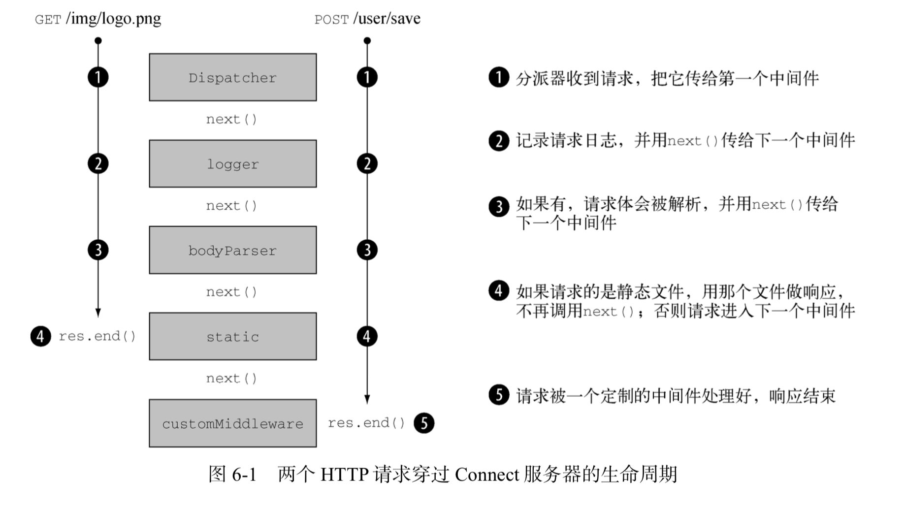

## 1. 深入了解Connect和Express

介绍最常用的模式， 放心食用！

Connect和Express有什么关系呢？

简言之，Express是在Connect的基础上，通过添加了一些高层语法糖扩展搭建出来的。

## 2. Connect

### 2.1 简单demo

Connect是Express的基础，实际上用Connect就能做出完整的Web程序。

先来安装connect
```bash
yarn add connect@3.4.0
```

写一个hello,world
```js
const app = require('connect')()

app.use((req, res, next) => {
    res.end('hello, world')
})

app.listen(3000)
```

### 2.2 了解Connect中间件的工作机制

`Connect`中间件就是一个js函数， 带有三个参数`req, res, next`
重点说一下next，**next是一个回调函数，当一个中间件完成自己的工作，要执行后续中间件的时候，可以调用这个回调函数**

一图胜千言。


值的注意的是，connect中间件是串行执行的，在koa中则是洋葱模型

### 2.3 自己写一个logger中间件

```js
const app = require('connect')()

const logger = (req, res, next) => {
    console.log('%s %s', req.method, req.url)
    next()
}
app.use(logger)
app.use((req, res, next) => {
    res.end('hello, world')
})

app.listen(3000)
```

写中间件的时候必须调用next()，控制权才会交回给分派器，才能调用下一个中间件

### 2.4 写一个更通用的可配置中间件

之前写的logger函数，输出信息是写死在中间件里的，因此不足够好，这次创建一个更通用的中间件模式
为了做到可配置， 这种模式一般都遵循一个原则。用一个函数返回另一个函数（闭包）
```js
const setup(options) {
    // 设置逻辑

    return function(req, res, next) {
        // 中间件逻辑

    }
}
```


下面重写我们的logger
```js
const logger = (format) => {
    const regexp = /:(\w+)/g
    return (req, res, next) => {
        const str = format.replace(regexp, (match, property) => {
            return req[property]
        })
        console.log(str)
        next()
    }
}

app.use(logger(":method :url"))
```

注意到使用了正则，和[replace方法](https://developer.mozilla.org/zh-CN/docs/Web/JavaScript/Reference/Global_Objects/String/replace)

### 2.5 使用错误处理中间件

当你使用错误中间件的时候，Connect遇到错误时，会跳过其他的中间件，直接跳到错误中间件


